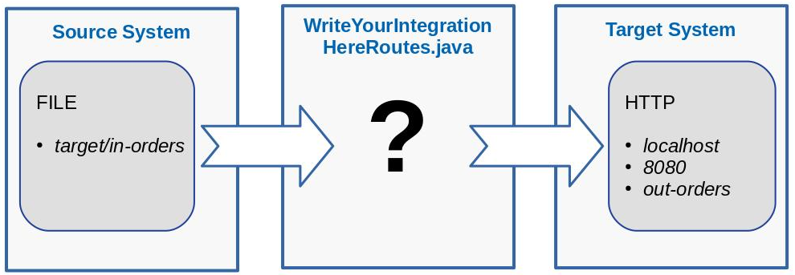
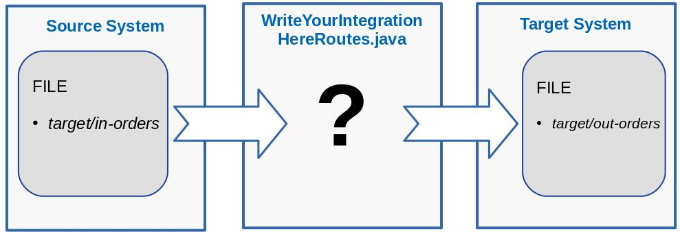
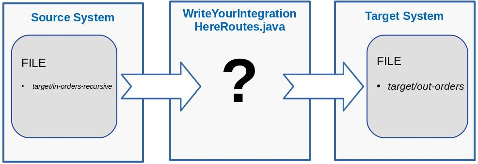

# Camel Quarkus Workshop

## About

(Estimated time : 10 minutes)

This repository contains several assignments that will help you get started with Integration using [Apache Camel](https://camel.apache.org/) and [Quarkus](https://quarkus.io/).

The workshop is structured into different sections :

* [Prerequisites for the workshop](#prerequisites-for-the-workshop)
* [Part 1 - Quarkus DEV mode](#part-1---quarkus-dev-mode)
* [Part 2 - Camel Routes](#part-2---camel-routes)
* [Part 3 - Camel Components](#part-3---camel-components)
* [Part 4 - Enterprise Integration Patterns](#part-4---enterprise-integration-patterns)
* [Part 5 - Camel Quarkus and Kafka](#part-5---camel-quarkus-and-kafka)
* [Part 6 - Quarkus JVM mode](#part-6---quarkus-jvm-mode)
* [Part 7 - Quarkus native mode](#part-7---quarkus-native-mode)

---
**⚠ WARNING**

It is strongly advised to go through the [prerequisites section](#prerequisites-for-the-workshop) as much as possible **at home prior to the workshop.** since
it requires > 2 GiB of downloads for the tools, sources, maven dependencies and docker images.
Downloading that much with a single shared connection from the workshop room could end up to be a rather poor experience.

---
**☕ BREAK**

Everyone can execute the workshop at their own pace, if you want to take a break you are welcome to take it at your own leisure.

## Prerequisites for the workshop

(Estimated time : 20 minutes)

Make sure you have the following prerequisites installed on your machine:

Please find below the list of tools needed for this workshop.
It is strongly advised to install as much as possible prior to the workshop.

* Git >= 2.43.2 advised
* A Java IDE like Eclipse, IntelliJ or VS Code, or at least a text editor like Vim
* JDK 21 installed, please ensure that JAVA_HOME is configured appropriately (otherwise it leads to various sort of issues)
* Maven >= 3.9.6 advised
* A favorite HTTP client like curl
* [Podman](https://podman-desktop.io) or Docker >= 25.0.3 advised (if a container runtime is missing, no big deal, you only need it for part-7 and some concepts in part-5)
* Windows and MAC users interested in native mode should install GraalVM native-image >= 21.0.2+13.1 and required tools (like Visual C++ Build Tools and so on)

To check whether some prerequisites are already installed on your machine, you can perform the following commands:

```bash
[dev@camel-quarkus-workshop]$ git --version
git version 2.43.2

[dev@camel-quarkus-workshop]$ vim --version
VIM - Vi IMproved 9.1 (2024 Jan 02, compiled Feb 16 2024 00:00:00)

[dev@camel-quarkus-workshop]$ java -version
openjdk 21 2023-09-19 LTS
OpenJDK Runtime Environment Temurin-21+35 (build 21+35-LTS)
OpenJDK 64-Bit Server VM Temurin-21+35 (build 21+35-LTS, mixed mode, sharing)

[dev@camel-quarkus-workshop]$ mvn --version
Apache Maven 3.9.6 (bc0240f3c744dd6b6ec2920b3cd08dcc295161ae)
Maven home: /home/myname/dev/maven/apache-maven-3.9.6-upstream
Java version: 21, vendor: Eclipse Adoptium, runtime: /home/myname/.sdkman/candidates/java/21-tem
Default locale: en_US, platform encoding: UTF-8
OS name: "linux", version: "6.7.5-200.fc39.x86_64", arch: "amd64", family: "unix"

[dev@camel-quarkus-workshop]$ curl --version
curl 8.2.1 (x86_64-redhat-linux-gnu) libcurl/8.2.1 OpenSSL/3.1.1 zlib/1.2.13 libidn2/2.3.7 nghttp2/1.55.1

[dev@camel-quarkus-workshop]$ docker --version
Docker version 25.0.3, build 4debf41
```

Describing all the ways to install the prerequisites is beyond the scope of this workshop, but here are some useful links to get started:

* [https://maven.apache.org/install.html](https://maven.apache.org/install.html)
* [https://sdkman.io/usage](https://sdkman.io/usage)
* [https://docs.docker.com/get-docker/](https://docs.docker.com/get-docker/)
* [https://medium.com/@gayanper/sdkman-on-windows-661976238042](https://medium.com/@gayanper/sdkman-on-windows-661976238042)
* [https://maven.apache.org/guides/getting-started/windows-prerequisites.html](https://maven.apache.org/guides/getting-started/windows-prerequisites.html)
* [https://quarkus.io/guides/building-native-image](https://quarkus.io/guides/building-native-image)
* [https://www.youtube.com/watch?v=2CmBkybJNnA](https://www.youtube.com/watch?v=2CmBkybJNnA)
* [https://codetinkering.com/install-graalvm-native-image-mac/](https://codetinkering.com/install-graalvm-native-image-mac/)

As a next step, let's clone the workshop github project locally in a folder of your choice. Let's call this folder `${CQ_WORKSHOP_DIRECTORY}` :

```bash
cd ${CQ_WORKSHOP_DIRECTORY}
git clone https://github.com/aldettinger/camel-quarkus-workshop.git
```

Note that during the workshop, you'll have to replace `${CQ_WORKSHOP_DIRECTORY}` with the folder you have just chosen.
For instance, one can list all the sub-directories from the workshop folder as below:

```bash
ls "${CQ_WORKSHOP_DIRECTORY}/camel-quarkus-workshop"
```

You should see something similar to below:

```bash
part-2-routes
part-3-components
part-4-eips
part-5-kafka
part-6-jvm-mode
part-7-native-mode

```

There is currently no folder starting with `part-1-` ! Well spotted, that's totally fine as we'll create it later on.

Next step, let's pre-download as many required maven dependencies as possible, for instance as below:

```bash
cd "${CQ_WORKSHOP_DIRECTORY}/camel-quarkus-workshop"
mvn quarkus:go-offline -fae
mvn dependency:go-offline -fae
mvn clean package -fae -pl -part-2-routes
cd part-5-kafka
mvn clean quarkus:dev
```

The build could fail at this stage but the main idea is to pre-download as many maven dependencies as possible.
Interrupt the last command with CTRL+C or q.

Finally, let's pre-pull the container images, like below:

```bash
docker pull quay.io/quarkus/ubi-quarkus-mandrel-builder-image:jdk-21
```

Setting up the requirements should be done now: **Congratulations !**

## Part 1 - Quarkus DEV mode

Estimated time : 10 minutes

In this section, we'll have our first contact with Quarkus.
Quarkus offers multiple modes: DEV, JVM, native... which have multiple purposes.
The idea behind DEV mode is to simplify developer's lives.
Let's start with the creation of a Camel Quarkus project.

There are multiple ways to create a project from scratch.
One could generate a new project using a [command line like the quarkus CLI or maven](https://quarkus.io/guides/maven-tooling).
If you'd rather use the UI, you can go to [code.quarkus.io](https://code.quarkus.io/) 
and download a zipped archive that you can unpack to get started.

### Create the project via the quarkus-maven-plugin

Let's open a first terminal, and call it the *DEV terminal*.
In the *DEV terminal*, type the following commands:

```bash
cd "${CQ_WORKSHOP_DIRECTORY}/camel-quarkus-workshop"
mvn io.quarkus:quarkus-maven-plugin:3.8.1:create -DplatformVersion=3.8.1
```

We need to specify the artifactId, extensions and code start. For groupId and version, simple press enter as shown below:

```bash
Set the project groupId: 
Set the project artifactId: part-1-dev-mode
Set the project version: 
What extensions do you wish to add (comma separated list): platform-http
Would you like some code to start (yes), or just an empty Quarkus project (no): no
```

### Create the project via code.quarkus.io

If you have issues using the `quarkus-maven-plugin`, as a fallback you can also generate the project graphically:

* Navigate to [code.quarkus.io](https://code.quarkus.io/)
* On the top of the page, select the right release stream `3.8`
* Fill in the `Artifact` field with value `part-1-dev-mode`
* In the `Filters` field, add the required extension `camel-quarkus-platform-http`
* Check the box `Camel Platform HTTP`
* Click the `Generate your application` button
* Click the `DOWNLOAD THE ZIP` button
* Unzip the `part-1-dev-mode` folder in the `${CQ_WORKSHOP_DIRECTORY}/camel-quarkus-workshop/` folder

### Start the generated project

Once the project is generated, so let's start it up:

```bash
cd "${CQ_WORKSHOP_DIRECTORY}/camel-quarkus-workshop/part-1-dev-mode"
mvn clean quarkus:dev
```

Quarkus has just started in DEV mode and printed interesting logs like the Camel version, the Quarkus version, start time and so on:

```bash
 --/ __ \/ / / / _ | / _ \/ //_/ / / / __/ 
 -/ /_/ / /_/ / __ |/ , _/ ,< / /_/ /\ \   
--\___\_\____/_/ |_/_/|_/_/|_|\____/___/   
2022-01-05 14:33:05,889 INFO  [org.apa.cam.qua.cor.CamelBootstrapRecorder] (Quarkus Main Thread) Bootstrap runtime: org.apache.camel.quarkus.main.CamelMainRuntime

2022-01-05 14:33:05,977 INFO  [org.apa.cam.imp.eng.AbstractCamelContext] (Quarkus Main Thread) Routes startup (total:1 started:1)
2022-01-05 14:33:05,978 INFO  [org.apa.cam.imp.eng.AbstractCamelContext] (Quarkus Main Thread)     Started route1 (platform-http:///cq-http-endpoint)
2022-01-05 14:33:05,978 INFO  [org.apa.cam.imp.eng.AbstractCamelContext] (Quarkus Main Thread) Apache Camel 3.14.0 (camel-1) started in 36ms (build:0ms init:30ms start:6ms)
2022-01-05 14:33:06,034 INFO  [io.quarkus] (Quarkus Main Thread) part-1-dev-mode 1.0.0-SNAPSHOT on JVM (powered by Quarkus 3.0.0.Beta1) started in 1.481s. Listening on: http://localhost:8080
2022-01-05 14:33:06,035 INFO  [io.quarkus] (Quarkus Main Thread) Profile dev activated. Live Coding activated.
2022-01-05 14:33:06,035 INFO  [io.quarkus] (Quarkus Main Thread) Installed features: [camel-attachments, camel-core, camel-platform-http, cdi, smallrye-context-propagation, vertx]

```

Now, let's create a second terminal, we'll call the *USER terminal*.

The next step is to configure our first camel route by creating a new `org.acme.MyRoutes` Java class.
You can do it in your IDE or if you have a POSIX compatible terminal, you can use the following commands:

```bash
cd ${CQ_WORKSHOP_DIRECTORY}/camel-quarkus-workshop/part-1-dev-mode
mkdir -p src/main/java/org/acme/
touch src/main/java/org/acme/MyRoutes.java
```

Hey, wait, something has just happened in the quarkus *DEV terminal*.
Quarkus has detected a change in the application source code and automatically reloaded the project.

Now let's implement our first camel route in `src/main/java/org/acme/MyRoutes.java`:

```java
package org.acme;

import jakarta.enterprise.context.ApplicationScoped;

import org.apache.camel.builder.RouteBuilder;

@ApplicationScoped
public class MyRoutes extends RouteBuilder {

    @Override
    public void configure() {
        from("platform-http:/cq-http-endpoint").setBody(constant("Hello Camel Quarkus in DEV mode !"));
    }
}
```

We'll explain the Camel syntax a bit more later on,
but at this stage, it should be enough to know that we have just created a Camel application listening for incoming HTTP requests and answering with an hard-coded response.

Visit [http://localhost:8080/cq-http-endpoint](http://localhost:8080/cq-http-endpoint) in your browser, or if you prefer `curl` type the following in the *USER terminal*:

```bash
curl http://localhost:8080/cq-http-endpoint
```

We should see an HTTP response as below:

```bash
Hello Camel Quarkus in DEV mode !
```

Now, in `src/main/java/org/acme/MyRoutes.java` let's update the hard-coded response to `Hello Camel Quarkus from the workshop room !`:

```bash
from("platform-http:/cq-http-endpoint").setBody(constant("Hello Camel Quarkus from the workshop room !"));
```

Refresh your browser or re-run `curl` again:

```bash
curl http://localhost:8080/cq-http-endpoint
```

We can see that the message has been updated:

```bash
Hello Camel Quarkus from the workshop room !
```

Now, let's stop the quarkus DEV mode by pressing `q` or `CTRL+C` in the *DEV terminal*.
We should see logs stating that the Camel routes are stopping:

```bash
2022-01-05 14:34:34,412 INFO  [org.apa.cam.imp.eng.AbstractCamelContext] (Shutdown thread) Routes stopped (stopped:1)
2022-01-05 14:34:34,412 INFO  [org.apa.cam.imp.eng.AbstractCamelContext] (Shutdown thread)     Stopped route2 (platform-http:///cq-http-endpoint)
```

That's it for our first contact with the Quarkus DEV mode.
We have seen that it offers a continuous feedback loop to help with development.
The DEV mode offers many more features. When you have time, we encourage you to take a look at:

* [https://quarkus.io/guides/continuous-testing](https://quarkus.io/guides/continuous-testing)
* [https://quarkus.io/guides/dev-services](https://quarkus.io/guides/dev-services)

## Part 2 - Camel Routes

Estimate time : 20 minutes

When facing a typical integration challenge, one first needs to extract a **message** from a **source system**.
The content of the **message** may need to be transformed and finally sent to a **target system**.
With Camel, facing such a typical integration challenge is done by implementing a **route**.

Let's reuse the *DEV terminal* and attempt to build a route:

```bash
cd ${CQ_WORKSHOP_DIRECTORY}/camel-quarkus-workshop/part-2-routes
mvn clean quarkus:dev
```

You'll see some ERROR logs:

```bash
[ERROR] /home/workshop/camel-quarkus-workshop/part-2-routes/src/main/java/org/acme/MyRoutes.java:[13,18] <identifier> expected
```

As you might be able to tell, the current route definition is not complete. This is expected as some TODO items still need to be completed in the code.

Let's review the content of the `src/main/java/org/acme/MyRoutes.java` source file.
In the `configure()` method, a route is defined as below:

```java
public void configure() {
  /*TODO-FROM-CAMEL-DOC*/("timer:myTimer")
      .setBody(constant("Transformed message content"))
      ./*TODO-FROM-CAMEL-DOC*/("log:myLogCategory");
}
```

A Camel route is where the integration flow is defined.
Let's find the documentation explaining this concept in order to replace the `/*TODO-FROM-CAMEL-DOC*/` sections in the code above.
The route concept is not specific to Camel on Quarkus as it can also be used with Camel on OGSi, Camel on Spring Boot and so on.
In such a case, we need to look at the [Apache Camel User Manual](https://camel.apache.org/manual/).
In particular, let's review [the first paragraph in this page](https://camel.apache.org/manual/routes.html) in order to determine the two keywords needed to replace `/*TODO-FROM-CAMEL-DOC*/` in the code.

Now it's your turn, please replace the two comments in the `configure()` method with the two Camel keywords spotted in the documentation.
Once the two comments have been replaced with right keywords, let's run `mvn clean quarkus:dev` again from the *DEV terminal*:

```bash
mvn clean quarkus:dev
```

In the *DEV terminal*, you should now see a different error:

```bash
[ERROR] /home/workshop/camel-quarkus-workshop/part-2-routes/src/main/java/org/acme/MyRoutes.java:[11,9] cannot find symbol
[ERROR]   symbol:   method from(java.lang.String)
[ERROR]   location: class org.acme.MyRoutes
[ERROR] /home/workshop/camel-quarkus-workshop/part-2-routes/src/main/java/org/acme/MyRoutes.java:[12,26] cannot find symbol
[ERROR]   symbol:   method constant(java.lang.String)
[ERROR]   location: class org.acme.MyRoutes
```

That's because the code isn't finished yet.
Let's pay attention to the class declaration in the file `src/main/java/org/acme/MyRoutes.java`:

```java
public class MyRoutes /*TODO-FROM-CAMEL-QUARKUS-DOC*/ {
```

We need to complete the class declaration.
Camel Quarkus requires a bit of information to detect that the `MyRoutes` class needs to be bootstrapped.
This kind of information is specific to Camel Quarkus, so you will need to check in the [Camel Quarkus documentation](https://camel.apache.org/camel-quarkus/next/index.html).
More specifically, you should read the section explaining how to [define a route with the Java DSL](https://camel.apache.org/camel-quarkus/next/user-guide/defining-camel-routes.html#_java_dsl).

Once you have completed the class declaration, `mvn clean quarkus:dev` should now start the route. A new log line is written each second as below:

```bash
2022-01-05 16:12:54,889 INFO  [org.apa.cam.imp.eng.AbstractCamelContext] (Quarkus Main Thread) Routes startup (total:1 started:1)
...
2022-01-05 16:12:55,897 INFO  [myLogCategory] (Camel (camel-1) thread #1 - timer://myTimer) Exchange[ExchangePattern: InOnly, BodyType: String, Body: Transformed message content]
2022-01-05 16:12:56,887 INFO  [myLogCategory] (Camel (camel-1) thread #1 - timer://myTimer) Exchange[ExchangePattern: InOnly, BodyType: String, Body: Transformed message content]
2022-01-05 16:12:57,888 INFO  [myLogCategory] (Camel (camel-1) thread #1 - timer://myTimer) Exchange[ExchangePattern: InOnly, BodyType: String, Body: Transformed message content]
```

So, that's it? We have faced an integration challenge and implemented a route?
Sort of. This is just an example to start gently.
Speaking in Camel terminology, we have defined a route **consuming messages** from a **source system** (in this case a timer).
The content of each message is then transformed and **produced** to a **target system** (in this case a logger).

At this stage, it's time to stop the Camel Quarkus route in the *DEV terminal*, for instance by hitting `CTRL+C`:

```bash
2022-01-05 16:12:58,723 INFO  [org.apa.cam.imp.eng.AbstractCamelContext] (Shutdown thread) Apache Camel 3.14.0 (camel-1) shutting down
...
2022-01-05 16:12:58,740 INFO  [org.apa.cam.imp.eng.AbstractCamelContext] (Shutdown thread) Routes stopped (total:1 stopped:1)
2022-01-05 16:12:58,742 INFO  [org.apa.cam.imp.eng.AbstractCamelContext] (Shutdown thread)     Stopped route1 (timer://myTimer)
```

Notice the route shutdown summary. There was a single route running, and it's now stopped.

We'll see more involved examples in the coming sections.
But at this stage, let's simply remember the layout of a typical route and how to make Camel Quarkus bootstrap it.

Of course, there are more bootstrap options possible.
When you have time, we invite you to implement a route using the XML DSL helped with [this link](https://camel.apache.org/camel-quarkus/next/user-guide/defining-camel-routes.html#_xml_dsl).

Congratulations on completing this section!

## Part 3 - Camel Components

Estimated time : 40 minutes

In the previous section, we have seen that a Camel route offers keywords to consume and produce messages.
When facing integration challenges, those messages need to be consumed from/to a lot of disparate technologies.
Fortunately for us, Camel offers connectivity with more than 300 technologies via **components**.
Some components are only able to produce or consume messages, while other components might do both.

Camel components can be used in routes that could be deployed in multiple flavors like an OSGi bundle, a Spring Boot uber jar or even a Quarkus fast-jar.
In order to be usable in Camel Quarkus, a Camel component needs to be wrapped in what we call a Quarkus **extension**.
There are currently around 200 Camel Quarkus extensions working both in JVM mode and native mode.
In addition, there are also about 100 additional Camel Quarkus extensions available in JVM mode only.

### Let's learn where to find what in the Camel documentation

In order to start with Camel Quarkus extensions, please have a look at the [Camel Quarkus Extensions Reference](https://camel.apache.org/camel-quarkus/latest/reference/index.html).
See if you can answer the following questions using this reference document:

* How many extensions are able to interact with a Kudu data store ?
* Was is possible to send messages to Apache Pulsar messaging systems with Camel Quarkus version 1.1.0 in JVM mode ? And in native mode ?

The [Camel Quarkus Extensions Reference](https://camel.apache.org/camel-quarkus/latest/reference/index.html) gives a good overview of the extensions.
From there you can navigate to the documentation of a specific Camel Quarkus extension.
And from the documentation of a specific Camel Quarkus extension you can continue to the documentation of the underlying Camel component.
Now that the documentation layout is a bit clearer, you should be able to answer the following questions:

* What is the URI syntax of the extension used to send and receive message from a NATS messaging system?
* When communicating with Salesforce, will you be able to consume messages? produce messages?
* What is the default value of the  *proxyProtocol*  component option when storing/retrieving objects from an AWS S3 Storage Service?

### Let's configure a consumer and a producer

With the help of both Camel Quarkus and Camel documentations, we should now be able to create a simple route.
Let's move to the part 3 folder.

For instance, in the *DEV terminal*, type as below:

```bash
cd ${CQ_WORKSHOP_DIRECTORY}/camel-quarkus-workshop/part-3-components
mvn clean quarkus:dev
```

It starts a demo application simulating both a source and target systems.
To integrate both systems, we will need to create a route in the file `src/main/java/org/acme/WriteYourIntegrationHereRoutes.java`

As a starter exercise, the source system is regularly storing orders as files in the `target/in-orders` folder.
The destination system is expecting to receive such orders on an HTTP server.
The target HTTP server is running on `localhost`, the port is `8080` and the resourceUri is `out-orders`.



Don't know where to start in order to write such a route? Try to answer these questions first:

* What Camel keyword do I need to use in order to consume messages from a source system?
* What extension should I use to read files from the source system?
* What is the URI syntax of this extension in the Camel Quarkus documentation?
* What Camel keyword do I need to use in order to produce messages to a destination system?
* What extension should I use to send requests to external HTTP servers? - we advise [camel-quarkus-http](https://camel.apache.org/camel-quarkus/latest/reference/extensions/http.html)
* What Maven coordinates need to be present in the pom file in order to use `camel-quarkus-http`?
* Are there more details about the HTTP component URI format in the Camel Documentation?

Now, please write the corresponding route in the file `src/main/java/org/acme/WriteYourIntegrationHereRoutes.java`.
This route should take a single line of code.
When the route is correctly setup, the destination will print logs like below:

```bash
Target system received a message via the Camel Quarkus PLATFORM-HTTP extension
```

First integration written, well done.
But now the destination system company faces a budget cost and would not be able to run the HTTP server anymore.
They want to receive the orders as files in a folder named `target/out-orders`.



Amend the route in `src/main/java/org/acme/WriteYourIntegrationHereRoutes.java` accordingly, you should now see logs such as below:

```bash
Target system received a message via the Camel Quarkus FILE extension
```

So far, we have learned a bit more about Camel connectivity.
We are able to choose the right extensions and run them with default options.
In the next section, we'll learn how to tune endpoint options.

### Let's specify an endpoint option with a query parameter

Camel Quarkus extensions can be tuned in many ways.
There is always a good default value but you'll find that you may need to tweak values to your needs.
One possible way of doing this is to use query parameters.
Endpoint options are merely lower level tuning values explained in the [Camel documentation](https://camel.apache.org/components/latest/file-component.html#_configuring_endpoint_options).

As an exercise, please amend the route in order to read file messages from a new folder named `target/in-orders-recursive`.
Doh! No logs are produced meaning that the destination system is not receiving anything.
Indeed, it turns out that the messages are not stored as direct child of the `in-orders-recursive` folder.
So, we will need to consume the files recursively from sub-folders this time.



Please amend the route in `src/main/java/org/acme/WriteYourIntegrationHereRoutes.java` in order to read files recursively.
Questions below could help:

* Is there a query parameter to read recursively in the documentation table?
* What is the query parameter name ? and the default value?
* How to append such a query parameter to the endpoint URI in the route?
* Maybe there is a section in the Camel documentation about reading files recursively from a directory?

You should see messages as below:

```back
Target system received a message via the Camel Quarkus FILE extension
```

And that's it.
Hopefully you now have a better view of Camel Quarkus extensions.
Quarkus actually wraps Camel components to make them runnable with Quarkus.
Common default values are provided off the shelf.
If needed there are various ways to adjust the configuration of Camel endpoints.
Of course a lot of things happen under the hood thanks to Camel Quarkus extensions.
When you have time, we encourage you to read the pages below:

* [Create a new extension](https://camel.apache.org/camel-quarkus/latest/contributor-guide/create-new-extension.html)
* [Promote a JVM extension to native](https://camel.apache.org/camel-quarkus/latest/contributor-guide/promote-jvm-to-native.html)

Congratulations on completing this section!

## Part 4 - Enterprise Integration Patterns

Estimated time : 30 minutes

Being able to consume/produce messages from/to a lot of technologies is not always sufficient.
In order to face any integration challenges, one would need to have a sort of recipe book describing common integration patterns and how to apply them.
This is exactly the purpose of the [Enterprise Integration Patterns](https://www.enterpriseintegrationpatterns.com/) book.
The good news is that Camel provides some [implementations of those Enterprise Integration Patterns](https://camel.apache.org/components/latest/eips/enterprise-integration-patterns.html).
From now on, let's call them **EIPs**.

### Let's review the exercise layout

Let's navigate to the part 4 folder.
In the *DEV terminal*, type:

```bash
cd ${CQ_WORKSHOP_DIRECTORY}/camel-quarkus-workshop/part-4-eips
mvn clean quarkus:dev
```

The application should start and we should see the following logs:

```bash
2021-12-16 14:39:35,019 INFO  [route2] (Camel (camel-1) thread #0 - timer://produceEventsSteadily) Received event with headers[id=1, importance=2] AND body[20]
2021-12-16 14:39:36,014 INFO  [route2] (Camel (camel-1) thread #0 - timer://produceEventsSteadily) Received event with headers[id=3, importance=3] AND body[30]
2021-12-16 14:39:37,014 INFO  [route2] (Camel (camel-1) thread #0 - timer://produceEventsSteadily) Received event with headers[id=2, importance=1] AND body[10]
```

The application is producing groups of 3 consecutive events each 3 seconds.
Please note that those events have a header named `id`, another header named `importance` and finally a body.
Both the headers and the body have an integer value.
In Camel, there are more than just headers and body, but describing all those attributes is not in scope for this exercise.
At this stage, let's just keep in mind that when data flows through a Camel route, we have an exchange, containing a message, that can contain a body and some headers.

Those events are actually flowing through a route described in the `src/main/java/org/acme/WriteYourIntegrationHereRoutes.java` file that look as below:

```java
from("direct:events-source")/*@TODO: Use some eips here*/.to("direct:events-sink");
```

You may notice the `@TODO` section, this is where we will use some EIPs.

### Let's avoid receiving uninteresting messages

First exercise, please amend the route in `src/main/java/org/acme/WriteYourIntegrationHereRoutes.java` in order to avoid receiving messages with importance `2` or `3`.

Don't know where to start in order to write such a route, let's answer few questions:

* Where in the Camel documentation could I find the list of Camel EIP implementations ?
* Amongst those EIPs, which one can be used to avoid receiving uninteresting messages ?
* In the EIP specific documentation, is there an example of how to filter based on a message header ?
* In our events, what header name and integer value would we like to filter ?

You should be able to create such a route with a simple line of code in `src/main/java/org/acme/WriteYourIntegrationHereRoutes.java`.
When the route is correctly setup, the application will print logs only for events with importance `1` as below:

```bash
2022-01-05 17:29:03,530 INFO  [route5] (Camel (camel-2) thread #2 - timer://produceEventsSteadily) Received event with headers[id=2, importance=1] AND body[10]
2022-01-05 17:29:06,529 INFO  [route5] (Camel (camel-2) thread #2 - timer://produceEventsSteadily) Received event with headers[id=5, importance=1] AND body[10]
2022-01-05 17:29:09,530 INFO  [route5] (Camel (camel-2) thread #2 - timer://produceEventsSteadily) Received event with headers[id=8, importance=1] AND body[10]
```

Well done, we have been able to filter messages using a single line of code!

### Let's put events back into the correct order

Now the owner of the destination system changed its mind.
The expected output is no more to filter events according to importance.
Instead, inside a group of 3 events fired at the same moment, we would like those events to arrive in the correct order based on the header named `id`.

Please amend the route in `src/main/java/org/acme/WriteYourIntegrationHereRoutes.java` in order to receive events according to the `id` ascending order.

Don't know where to start in order to write such a route? Let's answer a few questions:

* What Camel EIP can be used to put messages back into the correct order ?
* Is there an example to change the order according to the value of the message body ?
* How could this example be adapted to change the order according to the value of a header ?
* In our events, what is the name of the header that define the correct message ordering ?

Again, you should be able to create such a route with just one simple line of code in `src/main/java/org/acme/WriteYourIntegrationHereRoutes.java`.
When the route is correctly setup, the application will print 3 log lines at a time. And inside those 3 log lines, you should see the `id` in increasing order:

```bash
2021-12-16 16:24:07,846 INFO  [route2] (Camel (camel-1) thread #0 - Batch Sender) Received event with headers[id=1, importance=2] AND body[20]
2021-12-16 16:24:07,847 INFO  [route2] (Camel (camel-1) thread #0 - Batch Sender) Received event with headers[id=2, importance=1] AND body[10]
2021-12-16 16:24:07,848 INFO  [route2] (Camel (camel-1) thread #0 - Batch Sender) Received event with headers[id=3, importance=3] AND body[30]
```

Nice to see those groups of 3 events treated in the correct order.

### Let's group and sum events

Finally, in our ever changing world, the context has changed and there is yet another expectation.
Now, independent of events having being fired at the same time or not, we would like to group sequences of 3 messages that have the same importance.
And then we'll need to compute the sum of the 3 corresponding bodies.

Please amend the route in `src/main/java/org/acme/WriteYourIntegrationHereRoutes.java` to group messages by importance and sum the bodies.

Don't know where to start in order to write such a route? Let's answer few questions:

* What Camel EIP can be used to combine individual messages to process them as a whole ?
* What do we need to write after the `from` statement in order to use this eip ?
* What is the correlation key/expression ? Do we correlate on header or body ?
* How do we define our own custom strategy to aggregate those 3 bodies with same importance ? What interface should we implement ?
* What would be the value of the `oldExchange` parameter when aggregating the first exchange ?
* What completion criteria should we use to delimit our group of messages ? completionTimeout ? completionSize ?

This should take about ten lines of codes.
Three lines should be output with an interval of 9 seconds as below:

```bash
2022-01-05 17:46:08,340 INFO  [route23] (Camel (camel-8) thread #10 - Aggregator) Received event with headers[id=1, importance=2] AND body[60]
2022-01-05 17:46:08,342 INFO  [route23] (Camel (camel-8) thread #10 - Aggregator) Received event with headers[id=3, importance=3] AND body[90]
2022-01-05 17:46:08,343 INFO  [route23] (Camel (camel-8) thread #10 - Aggregator) Received event with headers[id=2, importance=1] AND body[30]
2022-01-05 17:46:17,336 INFO  [route23] (Camel (camel-8) thread #10 - Aggregator) Received event with headers[id=10, importance=2] AND body[60]
2022-01-05 17:46:17,337 INFO  [route23] (Camel (camel-8) thread #10 - Aggregator) Received event with headers[id=12, importance=3] AND body[90]
2022-01-05 17:46:17,337 INFO  [route23] (Camel (camel-8) thread #10 - Aggregator) Received event with headers[id=11, importance=1] AND body[30]
```

Looking at the first log, we see a message with importance = 2 and body = 60 which is an aggregate of 3 events with importance = 2 and body = 20.

Well done ! So far, we have seen how some easy integration challenges can be implemented quickly with the help of Camel EIP implementations.
And by tapping into even more powerful options, Camel is able to handle far more complex cases.

Of course there are a lot more EIPs implemented in Camel.
When you have time, we invite you to take a look at:

* [The content based router EIP](https://camel.apache.org/components/latest/eips/choice-eip.html)
* [The dynamic router EIP](https://camel.apache.org/components/latest/eips/dynamicRouter-eip.html)
* [The kamelet EIP](https://camel.apache.org/components/latest/eips/kamelet-eip.html)

Congratulations on completing this section!

## Part 5 - Camel Quarkus and Kafka

Estimate timed : 25 minutes

### About this section

In this part, we will discover how easy and fast it is to :

* Stream data from and to Kafka
* Write to Slack
* Read / write to an SQL database with JPA
* Use external APIs
* Serialize Data
* Create REST API

We will also experience the joy of using [dev services](https://quarkus.io/guides/dev-services) in the development mode. No need to install any Kafka server or database.

### Introducing the example

This example will illustrate an application that will receive and process coffee orders. The application is designed around Event Driven Architecture and uses Kafka to communicate with external systems. The orders are stored within a database. The delivery team is notified on slack to go check the order. The delivery team can access information about orders to deliver using an API.

* Insert the orders within a Database
* Notify the delivery company using a specific API (This one will be provided during the session)

The application is designed around Event Driven Architecture and uses Kafka to handle those messages:

* The coffee orders to be processed are in a Kafka topic named `orders`
* The notifications to the delivery company are in a Kafka topic named `deliveries`

The application that create orders and notify delivery teams are external to our ecosystem.


Let's navigate to the part 5 folder.

### Dev Services

Quarkus supports the automatic provisioning of unconfigured services in development and test mode. For more information, you can check the [official Dev Services overview](https://quarkus.io/guides/dev-services).
As we are using Kafka and PostgreSQL without any configuration, Quarkus dev services will automatically start a Strimzi and PostgreSQL Testcontainer.
Start the app in dev mode. Notice that those 2 servers have been started.

### Generate coffee orders

In this part we use a Camel Route to simulate the external app that generates some coffee orders. Those orders are pushed to the Kafka topic named `orders`.

To achieve this, we will get random coffees from an [external API](https://random-data-api.com/api/coffee/random_coffee) that generates Random coffee.
The external API returns HTTP status 429 when invoked too often.
As such, we'll use a timer to call the API every 10s.
This should prevent our application from reaching the external API rate limit.
We use 2 extensions : [timer](https://camel.apache.org/camel-quarkus/latest/reference/extensions/timer.html) and [http](https://camel.apache.org/camel-quarkus/latest/reference/extensions/http.html), as described in [MyRoutes class](part-5-kafka/src/main/java/org/acme/MyRoutes.java):

```java
public class MyRoutes extends RouteBuilder {

    @Override
    public void configure() {
        from("timer:create-random-coffee-orders")
                .to("http:{{random-coffee-api}}");
    }
}
```

`random-coffee-api` value is described in the [application.properties configuration file](part-5-kafka/src/main/resources/application.properties). It contains the URI to the random coffee API.
The response from the API is in JSON format. We use the [Jackson Data Format](https://camel.apache.org/camel-quarkus/latest/reference/extensions/jackson.html) to convert from Json to [Coffee Java class](part-5-kafka/src/main/java/org/acme/Coffee.java).

```java
    .unmarshal().json(Coffee.class)
```

Then we use [bean extension](https://camel.apache.org/camel-quarkus/latest/reference/extensions/bean.html) to transform the body to a [Coffee Order](part-5-kafka/src/main/java/org/acme/CoffeeOrder.java). Note that we explicitly specify the method name `generateOrder` to select among the `myBean` methods.

```java
    .bean("myBean", "generateOrder")
```

Next, we convert the Java CoffeeOrder to a Json format before pushing it to the Kafka topic.

```java
 .marshal().json()
```

Now it's your part: push the result to the Kafka topic named `orders`, using the [Kafka extension](https://camel.apache.org/camel-quarkus/latest/reference/extensions/kafka.html).

---
**🚀NOTE**

Since we are using Quarkus dev services, no configuration is needed for the Kafka producer. All you need to provision is the Kafka topic name.

---

You should see some logs from the Kafka consumer.

### Implement the Kafka consumer : part 1 - insert into Database

Let's look at the Kafka consumer Route. This is the Route streaming from the Kafka topic `orders`.

```java
        from("kafka:orders")
            .log("received from kafka : ${body}");
```

Now let's change the log part, and insert the coming orders into the database. To write to Database, we use the [JPA extension](https://camel.apache.org/camel-quarkus/latest/reference/extensions/jpa.html).
Note that the CoffeeOrder table has been configured using JPA in the [CoffeeOrder class](part-5-kafka/src/main/java/org/acme/CoffeeOrder.java). The id is auto-generated.

The table is created automatically with JPA while Dev services starts PostgreSQL, thanks to this Quarkus configuration:

```java
#Hibernate : drop and create the database
quarkus.hibernate-orm.database.generation=drop-and-create
```

Now, you can delete the log instruction, and insert the order to the database using JPA producer. Note that the default operation of the JPA producer is inserting into database.

---
**🚀NOTE**

Make sure you convert the json message streamed from Kafka to Java, before using the JPA producer.

---

Now you can check you're adding new orders to the database with the REST endpoint `/order`, described in the Camel Route :

```java
rest("order-api").description("Coffee Orders REST service")
        .get("/order").description("The list of all the coffee orders")
        .to("direct:orders-api")
        .get("/order/{id}").description("A Coffee order by id")
        .to("direct:order-api");

from("direct:orders-api")
        .routeId("orders-api")
        .log("Received a message in route orders-api")
        .to("jpa:" + CoffeeOrder.class + "?namedQuery=findAll");
```

In this Route, we are using the REST DSL, to create an API. This API contains a GET endpoint that fetches all coffee orders using JPA and named Query `findAll`.
This named query is described in the [CoffeeOrder class](part-5-kafka/src/main/java/org/acme/CoffeeOrder.java).

Now check using :

```bash
curl http://localhost:8080/order-api/order
```

Congrats! You've just learned how easy it is to stream from and to Kafka and to write in a SQL database with Camel.

### Implement the Kafka consumer : part 2 - Send notifications to Slack

Once a coffee order is inserted into the database, the Route should also send a notification to a Slack Channel.
In order to check your notifications, connect to the Slack channel provided by the organizers during this workshop.

---
**🚀NOTE**

If you are running this workshop alone. Create a slack workspace. Create a dedicated channel. Create a Slack application for this channel and set up a Webhook URL.

---

The notification is a String message containing the new order id. By the way, once inserted into the database, the CoffeeOrder object has its id generated with JPA.
The message is generated with the bean Method `MyBean.generateNotification`. Change the message using your own name. As all participants will be sending the same message. The name will help identify those messages.

Now use the [bean extension](https://camel.apache.org/camel-quarkus/latest/reference/extensions/bean.html) to transform the CoffeeOrder to this message.

Next, send this message to the slack channel. To achieve this, you'll need to use the [Slack extension](https://camel.apache.org/camel-quarkus/latest/reference/extensions/slack.html) to produce the message. The organizers have created a Slack application and will provide you with the Webhook URL that is needed to configure slack.
Put the webhook URL in the [application.properties configuration file](part-5-kafka/src/main/resources/application.properties).

```java
#Ask workshop organizers to give you the Webhook URL needed to setup the config for slack
webhook-url=INSERT_HERE_VALUE
```

Next check that the notifications are visible in the Slack channel.

Congrats! you have been able to use Java Beans to transform messages. Also, you discovered how to send messages easily to a Slack channel.

### Get a coffee order by id

Once a notification is sent to the Slack channel, you'll probably want to check the order.

To achieve that, we will create a GET endpoint that gets an order by its id. Go back to [MyRoutes class](part-5-kafka/src/main/java/org/acme/MyRoutes.java). Check the REST Route.
Notice that a part of the route is commented.
Please uncomment it and implement the missing part.

This part creates a REST endpoint that gets an order with an id. That id is set as REST parameter.
Use JPA to find the CoffeeOrder by id.
Use a `JPA` producer with the `query` endpoint option.

To help you, this is the JPA query you would use:

```SQL
select m from org.acme.CoffeeOrder m  where id = ${header.id}
```

The `id` path parameter has been automatically stored by Camel as a header named `id`.
In order to send the query to the JPA producer with a dynamic header value such as ${header.id}, you will need to use [To Dynamic EIP](https://camel.apache.org/components/latest/eips/toD-eip.html).

Next convert the message to JSON.

And finally, test your REST endpoint.

```bash
curl http://localhost:8080/order-api/order/1
```

Congrats! You've just learned few more Camel Quarkus tricks.

## Part 6 - Quarkus JVM mode

Estimate time : 15 minutes

With the JVM mode, we enter into the core of the Quarkus philosophy.
The tradeoffs that were made in JVMs in terms of startup time, memory usage and performance for traditional applications are not valid anymore in the cloud era where containers, and by extension JVMs, are started and stopped more frequently.
In this respect, it makes sense to perform as many tasks as possible once and for all at build time.

The illustration below shows the difference between starting a typical Java framework vs starting Quarkus, images courtesy from [Quarkus: The Black Swan of Java](https://www.jug.ch/events/slides/200430_jugch_Quarkus_-_Black_Swan_of_Java.pdf):


Building a Camel Quarkus route in JVM mode is simple. In the *DEV terminal*, type commands as below:

```
cd ${CQ_WORKSHOP_DIRECTORY}/camel-quarkus-workshop/part-6-jvm-mode
mvn clean package
```

It should take only few seconds.
Let's look at the produced artifacts, for instance using the command below:

```
ls target/quarkus-app
```

It should exhibit a directory structure as below:

```
app  lib  quarkus  quarkus-app-dependencies.txt  quarkus-run.jar

```

In JVM mode, the application has actually been packaged as a **fast-jar**.
Indeed, Quarkus has even designed its own packaging format in order to [provide faster startup times](https://www.youtube.com/watch?v=ogbMLeU1ogk).
So far so good, we can start our Camel route in JVM mode as shown below:

```bash
java -jar target/quarkus-app/quarkus-run.jar
```

At this stage, we'll record the startup times. Please locate the two lines that looks like below:

```bash
2022-01-05 14:44:54,366 INFO  [org.apa.cam.imp.eng.AbstractCamelContext] (main) Apache Camel 3.14.0 (camel-1) started in 52ms (build:0ms init:42ms start:10ms)
2022-01-05 14:44:54,460 INFO  [io.quarkus] (main) part-6-jvm-mode 1.0.0-SNAPSHOT on JVM (powered by Quarkus 3.0.0.Beta1) started in 0.855s. Listening on: http://0.0.0.0:8080
```

Pay attention to the Camel start time and also to the Quarkus start time.
You can compare them with your neighbors if you'd like :) But the important part is to make a mental note of them for the next section.

Now let's check that our Camel Quarkus route in JVM mode behaves the same way as in DEV mode.
In the *USER terminal*, use you favorite HTTP client, for instance:

```bash
curl localhost:8080/cq-http-endpoint

```

We should have the same answer as in part 1:

```bash
Hello Camel Quarkus in JVM mode from the workshop room !
```

At this point, we have seen that Quarkus can start quicker than typical Java frameworks in JVM mode.
In a container world where the time to serve the first request is a key metric, this is a huge advantage.
Quarkus offers other significant improvements, for instance related to startup memory.
When you have time, we encourage you to have a look at the RSS memory used on startup.
Unix users could find the command `ps -e -o rss,comm,args | grep "quarkus-run.jar$"` useful.

As a last step, we just need to stop our Camel Quarkus route. For instance, by hitting CTRL+C.

Well done for the JVM mode ! Let's tackle a more tricky part now. In next section, we'll try to compile our Camel Quarkus route as a native executable.

## Part 7 - Quarkus native mode

Estimated time : 20 minutes

The Quarkus philosophy is to move as many tasks as possible at build time.
Native mode goes one step further in this direction.
Native mode is based on a different kind of virtual machine, namely the [SubstrateVM](https://docs.oracle.com/en/graalvm/enterprise/20/docs/reference-manual/native-image/SubstrateVM/) from the [GraalVM project](https://www.graalvm.org/).

In native mode, a lot more happens ahead of (run)time. It basically gets rid of the dynamic just-in-time compilation that happens during startup, and moves (virtually) everything to the build time. It then leverages native system compilers (eg. gcc in Linux) to compile the code down to a native image, removing the need for a JVM altogether.

Completing the setup to enable native compilation can be a bit tricky during a workshop.
It's especially hard for MAC and Windows users. You can find more information on how to install it in [this documentation](https://quarkus.io/guides/building-native-image).
Folks that have installed GraalVM native image and required tools could try to build with `-Dnative`:

```bash
cd ${CQ_WORKSHOP_DIRECTORY}/camel-quarkus-workshop/part-7-native-mode
mvn clean package -Dnative
```

Alternatively if you did not / could not install GraalVM native image and required tools, then Quarkus can do the native build directly in a container. More information about this here: [creating a Linux executable without GraalVM installed](https://quarkus.io/guides/building-native-image#container-runtime).
However, note that it will produce a native executable for Linux even when building on MAC and Windows so you will need to run the natively built application in a container as well.

---
**💡 TIP**

Container builds are resource hungry.
Check the memory settings of your Docker installation and set it to 6 or even 8 GB at least if possible.

---

In the *DEV terminal*, let's trigger a container build by setting `quarkus.native.container-build=true`:

```bash
cd ${CQ_WORKSHOP_DIRECTORY}/camel-quarkus-workshop/part-7-native-mode
mvn clean package -Dnative -Dquarkus.native.container-build=true
```

Either way, building with GraalVM native image whether installed directly on your machine or via container takes a bit of time.
Be patient and at the end of the day, it should produce logs like below:

```bash
=========================================================================================================
GraalVM Native Image: Generating 'part-7-native-mode-1.0.0-SNAPSHOT-runner' (executable)...
=========================================================================================================
[1/7] Initializing...                                                                     (8.5s @ 0.27GB)
 Version info: 'GraalVM 22.2.0 Java 11 CE'
 Java version info: '11.0.16+8-jvmci-22.2-b06'
 C compiler: gcc (redhat, x86_64, 4.8.5)
 Garbage collector: Serial GC
 4 user-specific feature(s)
 - io.quarkus.runner.Feature: Auto-generated class by Quarkus from the existing extensions
 - io.quarkus.runtime.graal.DisableLoggingFeature: Disables INFO logging during the analysis phase for the [org.jboss.threads] categories
 - io.quarkus.runtime.graal.ResourcesFeature: Register each line in META-INF/quarkus-native-resources.txt as a resource on Substrate VM
 - org.graalvm.home.HomeFinderFeature: Finds GraalVM paths and its version number
[2/7] Performing analysis...  [*********]                                                (45.3s @ 1.71GB)
  12,585 (85.02%) of 14,803 classes reachable
  17,685 (62.29%) of 28,391 fields reachable
  58,742 (55.69%) of 105,474 methods reachable
     521 classes,    10 fields, and 4,287 methods registered for reflection
      69 classes,    88 fields, and    55 methods registered for JNI access
       5 native libraries: dl, pthread, rt, stdc++, z
[3/7] Building universe...                                                                (6.6s @ 3.99GB)
[4/7] Parsing methods...      [***]                                                       (6.1s @ 3.84GB)
[5/7] Inlining methods...     [***]                                                       (3.4s @ 1.54GB)
[6/7] Compiling methods...    [******]                                                   (38.1s @ 3.41GB)
[7/7] Creating image...                                                                   (5.3s @ 5.09GB)
  22.55MB (43.06%) for code area:    37,913 compilation units
  29.29MB (55.94%) for image heap:  285,758 objects and 598 resources
 537.01KB ( 1.00%) for other data
  52.37MB in total
---------------------------------------------------------------------------------------------------------
Top 10 packages in code area:                       Top 10 object types in image heap:
   1.58MB sun.security.ssl                             7.34MB java.lang.Class
 979.14KB java.util                                    4.87MB byte[] for code metadata
 767.55KB org.apache.camel.main                        2.62MB java.lang.String
 738.89KB org.apache.camel.impl.engine                 2.31MB byte[] for general heap data
 690.15KB com.sun.crypto.provider                      2.24MB byte[] for java.lang.String
 491.03KB org.apache.camel.support                     2.08MB byte[] for embedded resources
 479.03KB sun.security.x509                            1.15MB c.oracle.svm.core.hub.DynamicHubCompanion
 435.73KB java.util.concurrent                       717.91KB byte[] for reflection metadata
 420.21KB java.lang                                  574.97KB java.util.HashMap$Node
 391.78KB io.netty.buffer                            508.77KB java.lang.String[]
  15.41MB for 409 more packages                        4.52MB for 2622 more object types
---------------------------------------------------------------------------------------------------------
                 5.0s (4.2% of total time) in 31 GCs | Peak RSS: 6.23GB | CPU load: 6.15
---------------------------------------------------------------------------------------------------------
Produced artifacts:
 /home/agallice/dev/demos/camel-quarkus-demos/camel-quarkus-workshop/part-7-native-mode/target/part-7-native-mode-1.0.0-SNAPSHOT-native-image-source-jar/part-7-native-mode-1.0.0-SNAPSHOT-runner (executable)
 /home/agallice/dev/demos/camel-quarkus-demos/camel-quarkus-workshop/part-7-native-mode/target/part-7-native-mode-1.0.0-SNAPSHOT-native-image-source-jar/part-7-native-mode-1.0.0-SNAPSHOT-runner.build_artifacts.txt (txt)
```

As you can see there are a lot of things happening at build time and it took rather long.
This is one of the downsides when using native mode: slow builds, hard debugging, no just-in-time compilation of Java code. A few [development tricks](https://camel.apache.org/camel-quarkus/latest/user-guide/native-mode.html) could be needed as well, especially when using Java dynamic features such as Java reflection.

Let's see what we have produced, for instance by typing the command below

```bash
ls -al target/*runner
```

It should show a native executable, similar to below:

```bash
-rwxr-xr-x. 1 user user 56251784 Jan  5 14:55 target/part-7-native-mode-1.0.0-SNAPSHOT-runner
```

The size of 50/60 MiB may seem big for a Java application, but note that no JDK is needed to run this.
Indeed, during the long native compilation phase, all necessary parts from the JDK and third party libraries have been embedded into the native executable.

Now let's start our Camel Quarkus native route, for instance with the following command:

```bash
target/*runner
```

Like we did in JVM mode, we'll record the startup times. Please locate the two lines that look like below:

```bash
2022-01-05 14:58:17,729 INFO  [org.apa.cam.imp.eng.AbstractCamelContext] (main) Apache Camel 3.14.0 (camel-1) started in 1ms (build:0ms init:1ms start:0ms)
2022-01-05 14:58:17,734 INFO  [io.quarkus] (main) part-7-native-mode 1.0.0-SNAPSHOT native (powered by Quarkus 3.0.0.Beta1) started in 0.026s. Listening on: http://0.0.0.0:8080
```

Please pay attention to the Camel init/start time and also the Quarkus start time.
As you can see it is significantly faster than running the application in JVM mode. It is up to you to weigh the advantage of a fast startup time and smaller footprint of a native build vs the more straightforward, but slower startup of JVM mode.

Next, let's  check that our Camel Quarkus route in native mode behaves the same way as in DEV and JVM mode.
In the *USER terminal*, use you favorite HTTP client, for instance:

```bash
curl localhost:8080/cq-http-endpoint

```

We should expect the same answer as in part 1 and 6:

```bash
Hello Camel Quarkus in NATIVE mode from the workshop room !
```

We have only started to scratch the surface of the JVM and native mode.
Let's retain few lessons.
The application behaves the same in JVM and native mode, except in few exceptional cases.
However, the performance profile is clearly different between JVM and native mode.
Actually, the native mode and JVM mode are both great but adapted to different scenarios.

There are still a lot of things to know about the native mode.
When you have time, we encourage you to have a look at the RSS memory used on startup.
Unix users could find the command `ps -e -o rss,comm,args | grep "part-7-native-mode.*runner$"` useful.

A big congrats for having learned the native mode! It was a tricky part and maybe some of us were not able to build the native executable, but hopefully you got an idea of what its use is.

## A few tips to help organizers during the workshop

This section contains a few tips that could be useful for organizers during the workshop.

### Save/restore a docker image

```bash
docker save quay.io/quarkus/ubi-quarkus-native-image:22.3-java17 -o downloads/docker-ubi-quarkus-native-image_22_3-java17
docker image load -i downloads/docker-ubi-quarkus-native-image_22_3-java17
```

### Copy maven dependencies into a running container

```bash
docker cp downloads/m2-repository 99ef34eb8e2e:/root/.m2/repository
```

### How to simply share the webhook url needed for the kafka exercise

The URL contains sensitive information that's better not to be committed on github nor mailed.
So far, sharing a shortened version of the URL proves to be quite efficient.
Sometimes the URL redirection is not working permanently.
A trick is to paste the shortened URL in a web browser that will expand it.
From there, we can copy the expanded URL and use that expanded value in the `application.properties` configuration file.

### How to avoid user installing a specific maven version

Users might not want to install the maven version required by this workshop, or maybe have issues with their maven installation.
In such a case, it's possible to try using:

```bash
cd part-2-routes
./mvnw wrapper:wrapper -Dmaven=3.9.3
```

After that, we expect to have the right version:

```bash
./mvnw --version
Apache Maven 3.9.3 (21122926829f1ead511c958d89bd2f672198ae9f)
Maven home: /home/agallice/.m2/wrapper/dists/apache-maven-3.9.3-bin/326f10f4/apache-maven-3.9.3
```

And this trick would need to be run in each exercise folder, as exercises are independent.

### Upgrade the quarkus version in the workshop

Each module remains parent free for resiliency, flexibility and maven dependencies pre-download purpose.
As such, each part of the workshop remains independent and should be updated on its own.

At first, identify the latest quarkus-platform recommended version and upgrade to it, e.g:

```bash
find ./ -type f -exec sed -i 's/3.0.0.CR1/3.8.1/g' {} \;
```

Then identify the camel-quarkus version brought by the platform. For instance, by building part-2 and checking logs.
Given the camel-quarkus version, open the corresponding tag on github and check the main pom file.
In the pom, you should find `supported-maven-versions` and `graalvm.version`.

From there, the prerequisites section may need to be updated in few places:

* There is a bullet showing the maven version
* There is another bullet explaining that MAC and Windows users should install native-image
* At the end of the prerequisites, there is a docker pull command where the graalvm version may need to be updated

And finally, in `part-1`, we need to update the `Create the project via code.quarkus.io` section.
Indeed, we need to set the right release stream of `quarkus-platform` there in the second bullet.
