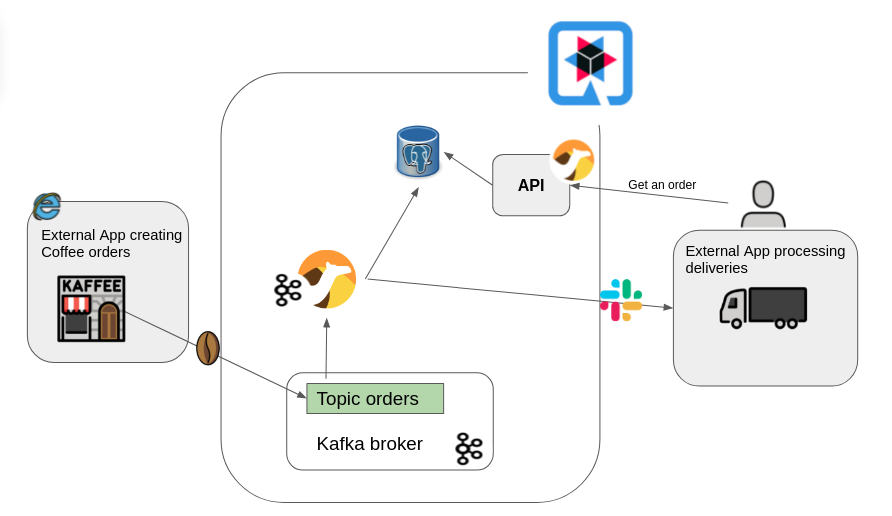
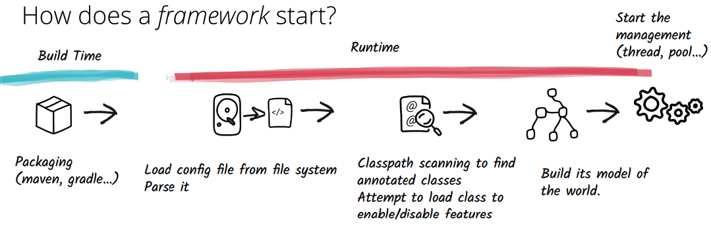
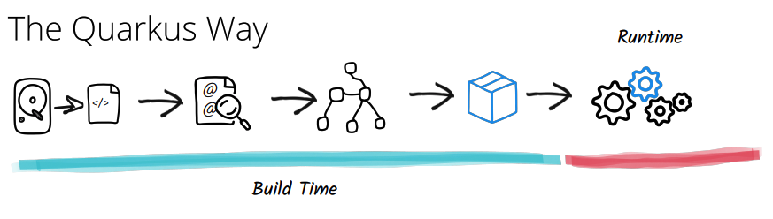

# Camel Quarkus Workshop

## About
(Estimate time : 10 minutes)

This repository contains several assignments that will help you get started with Integration with [Apache Camel](https://camel.apache.org/) & [Quarkus](https://quarkus.io/).

The workshop is structured into different sections :

* [Prerequisites for the workshop](#prerequisites-for-the-workshop)
* [Part 1 - Quarkus DEV mode](#part-1---quarkus-dev-mode)
* [Part 2 - Camel Routes](#part-2---camel-routes)
* [Part 3 - Camel Components](#part-3---camel-components)
* [Part 4 - Enterprise Integration Patterns](#part-4---enterprise-integration-patterns)
* [Part 5 - Camel Quarkus and Kafka](#part-5---camel-quarkus-and-kafka)
* [Part 6 - Quarkus JVM mode](#part-6---quarkus-jvm-mode)
* [Part 7 - Quarkus native mode](#part-7---quarkus-native-mode)
* [Bonus A - Deploying Camel Quarkus apps into the Cloud](#bonus-a---deploying-to-the-cloud)
* [Bonus B - Camel Quarkus and Kamelets](#bonus-b---camel-quarkus-and-the-kamelets)

---
**⚠ WARNING**

It is strongly advised to execute as much as possible the [prerequisites section](#prerequisites-for-the-workshop) **at home prior to the workshop.**
Indeed, more than 2 GiB of downloads could be expected for tools, sources, maven dependencies and docker images.
Downloading that much with a single shared connection from the workshop room could end up to be a poor experience.

## Prerequisites for the workshop
(Estimate time : 20 minutes)

Make sure you have the following prerequisites installed on your machine:

Please find below the list of tools needed for this workshop.
It is strongly advised to install as much as possible prior to the workshop.

 * Git >= 1.8.3.1 advised
 * A Java IDE like Eclipse or at least a text editor like Vim
 * JDK 11 installed
 * Maven >= 3.6.3 advised, possibly with JAVA_HOME configured appropriately
 * A favorite HTTP client like curl
 * Docker >= 1.13.1 installed (if docker is missing, that's no big deal, you may only miss part-7, and some concepts of part-5)

Let's check whether some prerequisites are already installed on your machine, for instance like below:

```
[dev@camel-quarkus-workshop]$ git --version
git version 1.8.3.1

[dev@camel-quarkus-workshop]$ vim --version
VIM - Vi IMproved 8.1 (2018 May 18, compiled Nov 08 2021 14:21:34)

[dev@camel-quarkus-workshop]$ java --version
openjdk 11.0.11 2021-04-20
OpenJDK Runtime Environment AdoptOpenJDK-11.0.11+9 (build 11.0.11+9)
OpenJDK 64-Bit Server VM AdoptOpenJDK-11.0.11+9 (build 11.0.11+9, mixed mode)

[dev@camel-quarkus-workshop]$ mvn --version
Apache Maven 3.8.1 (05c21c65bdfed0f71a2f2ada8b84da59348c4c5d)
Maven home: /home/user/dev/maven/apache-maven-3.8.1
Java version: 11.0.11, vendor: AdoptOpenJDK, runtime: /home/dev/.sdkman/candidates/java/11.0.11.hs-adpt
Default locale: en_US, platform encoding: UTF-8
OS name: "linux", version: "3.10.0-1160.45.1.el7.x86_64", arch: "amd64", family: "unix"

[dev@camel-quarkus-workshop]$ curl --version
curl 7.68.0 (x86_64-pc-linux-gnu) libcurl/7.68.0 OpenSSL/1.1.1f zlib/1.2.11 brotli/1.0.7 libidn2/2.2.0 libpsl/0.21.0 (+libidn2/2.2.0) libssh/0.9.3/openssl/zlib nghttp2/1.40.0 librtmp/2.3

[dev@camel-quarkus-workshop]$ docker --version
Docker version 1.13.1, build 7f2769b/1.13.1
```

Describing all the ways to have those prerequisites installed is beyond the scope of this workshop, still some useful links could be found below:
 * [https://maven.apache.org/install.html](https://maven.apache.org/install.html)
 * [https://sdkman.io/usage](https://sdkman.io/usage)
 * [https://docs.docker.com/get-docker/](https://docs.docker.com/get-docker/)
 * [https://medium.com/@gayanper/sdkman-on-windows-661976238042](https://medium.com/@gayanper/sdkman-on-windows-661976238042)
 * [https://maven.apache.org/guides/getting-started/windows-prerequisites.html](https://maven.apache.org/guides/getting-started/windows-prerequisites.html)

As a next step, let's clone the workshop github project locally in a folder of your choice, let's call this folder `${CQ_WORKSHOP_DIRECTORY}` :

```
cd ${CQ_WORKSHOP_DIRECTORY}
git clone https://github.com/aldettinger/camel-quarkus-workshop.git
```

Note that during the workshop, you'll have to replace `${CQ_WORKSHOP_DIRECTORY}` by the folder you have just chosen.
For instance, one can list all the sub-directories from the workshop folder as below:

```
ls "${CQ_WORKSHOP_DIRECTORY}/camel-quarkus-workshop"
```

You should see something similar to below:

```
bonus-a-cloud
images
part-2-routes
part-3-components
part-4-eips
part-5-kafka
part-6-jvm-mode
part-7-kafka
part-7-native-mode

```

There is currently no folder starting with `part-1-` ! Well spotted, that's totally fine as we'll create it later on.

Next step, let's pre-download as much required maven dependencies as possible, for instance as below:

```
cd "${CQ_WORKSHOP_DIRECTORY}/camel-quarkus-workshop"
mvn quarkus:go-offline -fae
mvn dependency:go-offline -fae
mvn clean package -fae
```

The build could fail at this stage but the main idea is to pre-download as much maven dependencies as possible.

Finally, let's pre-pull docker images, like below:

```
docker pull quay.io/quarkus/ubi-quarkus-native-image:21.3-java11
```

Setting up the requirements should be done now: **Congratulations !**

## Part 1 - Quarkus DEV mode
Estimate time : 20 minutes

In this section, we'll have our first contact with Quarkus. Indeed, Quarkus offers multiple modes DEV, JVM, native... for multiple purposes.
The idea behind the DEV mode is to simplify developers life. Better than words, let's start the creation of a Camel Quarkus project.

As such, let's create a first terminal, we'll call it the *DEV terminal*.
In the *DEV terminal*, type commands as below:

```
cd "${CQ_WORKSHOP_DIRECTORY}/camel-quarkus-workshop"
mvn io.quarkus:quarkus-maven-plugin:2.6.1.Final:create
```

We need to specify the artifactId, extensions and code start. For groupId and version, simple press enter as it was done below:

```
Set the project groupId: 
Set the project artifactId: part-1-dev-mode
Set the project version: 
What extensions do you wish to add (comma separated list): platform-http
Would you like some code to start (yes), or just an empty Quarkus project (no): no
```

Let's start the project, for instance:

```
cd part-1-dev-mode
mvn clean quarkus:dev
```

Quarkus has just started in DEV mode and print interesting logs like the Camel version, the Quarkus version, start time and so on:

```
 --/ __ \/ / / / _ | / _ \/ //_/ / / / __/ 
 -/ /_/ / /_/ / __ |/ , _/ ,< / /_/ /\ \   
--\___\_\____/_/ |_/_/|_/_/|_|\____/___/   
2022-01-05 14:33:05,889 INFO  [org.apa.cam.qua.cor.CamelBootstrapRecorder] (Quarkus Main Thread) Bootstrap runtime: org.apache.camel.quarkus.main.CamelMainRuntime

2022-01-05 14:33:05,977 INFO  [org.apa.cam.imp.eng.AbstractCamelContext] (Quarkus Main Thread) Routes startup (total:1 started:1)
2022-01-05 14:33:05,978 INFO  [org.apa.cam.imp.eng.AbstractCamelContext] (Quarkus Main Thread)     Started route1 (platform-http:///cq-http-endpoint)
2022-01-05 14:33:05,978 INFO  [org.apa.cam.imp.eng.AbstractCamelContext] (Quarkus Main Thread) Apache Camel 3.14.0 (camel-1) started in 36ms (build:0ms init:30ms start:6ms)
2022-01-05 14:33:06,034 INFO  [io.quarkus] (Quarkus Main Thread) part-1-dev-mode 1.0.0-SNAPSHOT on JVM (powered by Quarkus 2.6.1.Final) started in 1.481s. Listening on: http://localhost:8080
2022-01-05 14:33:06,035 INFO  [io.quarkus] (Quarkus Main Thread) Profile dev activated. Live Coding activated.
2022-01-05 14:33:06,035 INFO  [io.quarkus] (Quarkus Main Thread) Installed features: [camel-attachments, camel-core, camel-platform-http, cdi, smallrye-context-propagation, vertx]

```

Now, let's create a second terminal, we'll call it the *USER terminal*.

The next step is to configure our first camel route by creating the file `src/main/java/org/acme/MyRoutes.java`.
For instance, it can be done from the *USER terminal*, by typing the following commands:

```
cd ${CQ_WORKSHOP_DIRECTORY}/camel-quarkus-workshop/part-1-dev-mode
mkdir -p src/main/java/org/acme/
touch src/main/java/org/acme/MyRoutes.java
```

Hey, wait something has just happened in the quarkus *DEV terminal*.
Indeed, Quarkus has detected a change in the application source code and automatically reloaded the project.

Now let's implement our first camel route in `src/main/java/org/acme/MyRoutes.java` as below:

```
package org.acme;

import javax.enterprise.context.ApplicationScoped;

import org.apache.camel.builder.RouteBuilder;

@ApplicationScoped
public class MyRoutes extends RouteBuilder {

    @Override
    public void configure() {
        from("platform-http:/cq-http-endpoint").setBody(constant("Hello Camel Quarkus in DEV mode !"));
    }
}
```

We'll explain a bit more the Camel syntax later on.
But at this stage, it should be enough to know that we have just created a Camel application listening for incoming HTTP requests and answering with an hard-coded response.

Let's test that with your favorite HTTP client. For instance, in the *USER terminal*, type the following command:

```
curl http://localhost:8080/cq-http-endpoint
```

We should see the HTTP response as below:

```
Hello Camel Quarkus in DEV mode !
```

Now, in `src/main/java/org/acme/MyRoutes.java` let's update the hard-coded response to `Hello Camel Quarkus from the 3h workshop room !`:

```
from("platform-http:/cq-http-endpoint").setBody(constant("Hello Camel Quarkus from the 3h workshop room !"));
```

Let's test again with your favorite HTTP client. For instance, in the *USER terminal*, type the following command:

```
curl http://localhost:8080/cq-http-endpoint
```

We see that the message has been updated:

```
Hello Camel Quarkus from the 3h workshop room !
```

Now, let's stop the quarkus DEV mode by pressing `q` or `CTRL+C` in the *DEV terminal*.
We should see logs stating that the Camel routes are stopping as below:

```
2022-01-05 14:34:34,412 INFO  [org.apa.cam.imp.eng.AbstractCamelContext] (Shutdown thread) Routes stopped (total:1 stopped:1)
2022-01-05 14:34:34,412 INFO  [org.apa.cam.imp.eng.AbstractCamelContext] (Shutdown thread)     Stopped route2 (platform-http:///cq-http-endpoint)
```

That's it for our first contact with the Quarkus DEV mode.
We have seen that it offers a continuous feedback loop to help with development.
The DEV mode offers few more features. When you have time, we encourage you to take a look at:
 * [https://quarkus.io/guides/continuous-testing](https://quarkus.io/guides/continuous-testing)
 * [https://quarkus.io/guides/dev-services](https://quarkus.io/guides/dev-services)

## Part 2 - Camel Routes
Estimate time : 20 minutes

When facing a typical integration challenge, one first needs to extract a **message** from a **source system**.
The content of the **message** may need to be transformed and finally sent to a **target system**.
With Camel, facing such a typical integration challenge is done by implementing a **route**.

So, let's reuse the *DEV terminal* and attempt to build a route, for instance as below:

```
cd ${CQ_WORKSHOP_DIRECTORY}/camel-quarkus-workshop/part-2-routes
mvn clean quarkus:dev
```

Some ERROR logs like below are shown:

```
[ERROR] /home/workshop/camel-quarkus-workshop/part-2-routes/src/main/java/org/acme/MyRoutes.java:[13,18] <identifier> expected
[ERROR] /home/workshop/camel-quarkus-workshop/part-2-routes/src/main/java/org/acme/MyRoutes.java:[13,17] not a statement
[ERROR] /home/workshop/camel-quarkus-workshop/part-2-routes/src/main/java/org/acme/MyRoutes.java:[13,42] ';' expected
```

Indeed, the current route definition is not complete, that's expected as some TODO items needs to be completed in the code.

Let's review the content of the `src/main/java/org/acme/MyRoutes.java` source file.
In the `configure()` method, a route is defined as below:

```
public void configure() {
  /*TODO-FROM-CAMEL-DOC*/("timer:myTimer")
      .setBody(constant("Transformed message content"))
      ./*TODO-FROM-CAMEL-DOC*/("log:myLogCategory");
}
```

A Camel route is where the integration flow is defined.
Let's find the documentation explaining this concept in order to replace the `/*TODO-FROM-CAMEL-DOC*/` sections in the code above.
The route concept is not specific to Camel on Quarkus as it can also be used with Camel on OGSi, Camel on Spring Boot and so on.
In such a case, we need to look at the [Apache Camel User Manual](https://camel.apache.org/manual/).
Especially, let's review [the first paragraph in this page](https://camel.apache.org/manual/routes.html) in order to determine the two keywords needed to replace `/*TODO-FROM-CAMEL-DOC*/` in the code.

Once the two comments have been replaced with right keywords, let's run `mvn clean quarkus:dev` again from the *DEV terminal*:

```
mvn clean quarkus:dev
```

But in the *DEV terminal*, there is now yet another issue:

```
[ERROR] /home/workshop/camel-quarkus-workshop/part-2-routes/src/main/java/org/acme/MyRoutes.java:[11,9] cannot find symbol
[ERROR]   symbol:   method from(java.lang.String)
[ERROR]   location: class org.acme.MyRoutes
[ERROR] /home/workshop/camel-quarkus-workshop/part-2-routes/src/main/java/org/acme/MyRoutes.java:[12,26] cannot find symbol
[ERROR]   symbol:   method constant(java.lang.String)
[ERROR]   location: class org.acme.MyRoutes
```

Indeed, it's not finished.
Let's pay attention to the class declaration in the file `src/main/java/org/acme/MyRoutes.java`:

```
public class MyRoutes /*TODO-FROM-CAMEL-QUARKUS-DOC*/ {
```

We should complete the class declaration.
Indeed, Camel Quarkus requires a bit of information to detect that the `MyRoutes` class need to be bootstrapped.
Such an information is specific to Camel Quarkus, so it will reside in the [Camel Quarkus documentation](https://camel.apache.org/camel-quarkus/next/index.html).
Especially, please read the section explaining how to [define a route with the Java DSL](https://camel.apache.org/camel-quarkus/next/user-guide/defining-camel-routes.html#_java_dsl).

Once the class declaration has been completed, `mvn clean quarkus:dev` should now start the route. A new log line is written each second as below:

```
2022-01-05 16:12:54,889 INFO  [org.apa.cam.imp.eng.AbstractCamelContext] (Quarkus Main Thread) Routes startup (total:1 started:1)
...
2022-01-05 16:12:55,897 INFO  [myLogCategory] (Camel (camel-1) thread #1 - timer://myTimer) Exchange[ExchangePattern: InOnly, BodyType: String, Body: Transformed message content]
2022-01-05 16:12:56,887 INFO  [myLogCategory] (Camel (camel-1) thread #1 - timer://myTimer) Exchange[ExchangePattern: InOnly, BodyType: String, Body: Transformed message content]
2022-01-05 16:12:57,888 INFO  [myLogCategory] (Camel (camel-1) thread #1 - timer://myTimer) Exchange[ExchangePattern: InOnly, BodyType: String, Body: Transformed message content]
```

So, that's it ? We have faced an integration challenge and implemented a route ?
Sort of, it's just an example to start gently.
Talking with Camel words, we have defined a route **consuming messages** from a **source system** (here it's a timer).
The content of each message is then transformed and **produced** to a **target system** (here it's a logger).

At this stage, it's time to stop the Camel Quarkus route in the *DEV terminal*, for instance by hitting `CTRL+C`:

```
2022-01-05 16:12:58,723 INFO  [org.apa.cam.imp.eng.AbstractCamelContext] (Shutdown thread) Apache Camel 3.14.0 (camel-1) shutting down
...
2022-01-05 16:12:58,740 INFO  [org.apa.cam.imp.eng.AbstractCamelContext] (Shutdown thread) Routes stopped (total:1 stopped:1)
2022-01-05 16:12:58,742 INFO  [org.apa.cam.imp.eng.AbstractCamelContext] (Shutdown thread)     Stopped route1 (timer://myTimer)
```

Notice the route shutdown summary. There was a single route running, and it's now stopped.

We'll see more involved examples in the coming sections.
But at this stage, let's simply remember the layout of a typical route and how to make Camel Quarkus bootstrap it.

Of course, there are more bootstrap options possible.
When you have time, we invite you to implement a route using the XML DSL helped with [this link](https://camel.apache.org/camel-quarkus/next/user-guide/defining-camel-routes.html#_xml_dsl).

## Part 3 - Camel Components
Estimate time : 40 minutes

In the previous section, we have seen that a Camel route offers primitives to consume and produce messages.
Actually, when facing integration challenges, those messages need to be consumed from/to a lot of disparate technologies.
Lucky us, Camel offers connectivity with more than 300 technologies via **components**.
Some components are only able to produce or consume messages, while other components might do both.

Camel components can be used in routes that could be deployed in multiple favors like an OSGi bundle, a Spring Boot uber jar or even a Quarkus fast-jar.
In order to be usable in Camel Quarkus, a Camel component needs to be wrapped in what we call a Quarkus **extension**.
There are currently around 200 Camel Quarkus extensions working both in JVM mode and native mode.
In addition, there are also about 100 Camel Quarkus extensions more available but in JVM mode only.

### Let's review the documentations layout

In order to start with Camel Quarkus extensions, please have a look at the [Camel Quarkus Extensions Reference](https://camel.apache.org/camel-quarkus/latest/reference/index.html).
Now, you should be able to answer questions beneath:
 * How many extensions are able to interact with a Kudu data store ?
 * Was is possible to trade bitcoins with Camel Quarkus version 1.5.0 in JVM mode ? And in native mode ?

The [Camel Quarkus Extensions Reference](https://camel.apache.org/camel-quarkus/latest/reference/index.html) gives a good overview.
From there, you can navigate to the documentation of a specific Camel Quarkus extension.
And from the documentation of a specific Camel Quarkus extension, you should be able to access the documentation of the underlying Camel component.
Now that the documentation layout is a bit clearer, you should be able to answer questions below:
 * What is the URI syntax of the extension used to send and receive message from a NATS messaging system ?
 * When communicating with Salesforce, will you be able to consume messages ? produce messages ?
 * What is the default value of the  _proxyProtocol_  component option when storing/retrieving objects from an AWS S3 Storage Service ?

### Let's configure a consumer and a producer

With the help of both Camel Quarkus and Camel documentations, we should now be able to create a simple route.
Let's move to the part 3 folder.

For instance, in the *DEV terminal*, type as below:

```
cd ${CQ_WORKSHOP_DIRECTORY}/camel-quarkus-workshop/part-3-components
mvn clean quarkus:dev
```

It starts a demo application simulating both a source and target systems.
To integrate both systems, we will need to create a route in the file `src/main/java/org/acme/WriteYourIntegrationHereRoutes.java`

As a starter exercise, the source system is regularly storing orders as files in the `target/in-orders` folder.
The destination system is expecting to receive such orders on an HTTP server.
The target HTTP server is running on `localhost`, the port is `8080` and the resourceUri is `out-orders`.

Don't know where to start in order to write such a route, let's answer few questions:
 + What Camel primitive do I need to use in order to consume messages from a source system ?
 + What extension should I use to read files from the source system ?
 + What is the URI syntax of this extension in the Camel Quarkus documentation ?
 + What Camel primitive do I need to use in order to produce messages to a destination system ?
 + What extension should I use to send requests to external HTTP servers ? we advise camel-quarkus-http
 + What maven coordinates need to be present in the pom file in order to use camel-quarkus-http ?
 + Is there more details about the HTTP component URI format in the Camel Documentation ?

At the end of the day, one should be able to create such a route with a simple line of code in `src/main/java/org/acme/WriteYourIntegrationHereRoutes.java`.
When the route is correctly setup, the destination will print logs like below:

```
Target system received a message via the Camel Quarkus PLATFORM-HTTP extension
```

First integration written, well done.
But now the destination system company faces a budget cost and would not be able to run the HTTP server anymore.
They want to receive the orders as files in a folder named `target/out-orders`.

Please, amend the route accordingly, you should now see logs such as below:

```
Target system received a message via the Camel Quarkus FILE extension
```

So far, we have learned a bit more about Camel connectivity.
We are able to choose the right extensions and run them with default options.
In the next section, we'll learn how to tune endpoint options.

### Let's specify an endpoint option with a query parameter

The Camel Quarkus extensions could be tuned in a lot of fashion.
There is always a good default value but often you would need to tune that.
For instance, one way is to tune endpoint options using query parameters.
Endpoint options are merely lower level tuning explained in the [Camel documentation](https://camel.apache.org/components/latest/file-component.html#_configuring_endpoint_options).

As an exercise, please amend the route in order to read file messages from a new folder named `target/in-orders-recursive`.
D'oh! No logs are produced meaning that the destination system is not receiving anything.
Indeed, it turns out that the messages are not stored as direct child of the `in-orders-recursive` folder.
So, we will need to consume the files recursively from sub-folders this time.

Please amend the route in order to read files recursively.
Questions below could help:
 + Is there a query parameter to read recursively in the documentation table ?
 + What is the query parameter name ? and the default value ?
 + How to append such a query parameter to the endpoint URI in the route ?
 + Maybe there is section in the Camel documentation about reading files recursively from a directory ?

At the end of the day, you should see back messages as below:

```
Target system received a message via the Camel Quarkus FILE extension
```

### Let's tune a component option

Sometimes, setting a query parameter in a lot of from and to statements is a bit cumbersome.
It is a sign that we need something else, like a way to set an option at Camel component level.
Such options would then apply each time the Camel component is used in any routes of our application.
The Camel documentation gives more information, for instance [here](https://camel.apache.org/components/latest/file-component.html#_configuring_component_options).

This is exactly what happen in the next exercise.
And guess what, the target system changed its interface again.
Now, they would like to receive messages on an ActiveMQ 5.0 broker.
The broker URL is `tcp://localhost:61617` and messages should be sent to the queue named `out-orders`.
However, the configuration is a bit trickier this time as the Camel default value for the broker URL does NOT match our case.
We'll then need to tune it.

Please read the documentation paragraph describing [How to tune a Camel component with the application.properties file](https://camel.apache.org/camel-quarkus/next/user-guide/configuration.html#_application_properties)

Please amend the route in order to produce messages to this broker.
Don't know where to start, questions below might help:
 + What Camel Quarkus extension do we need to send messages to an Apache ActiveMQ server ?
 + What is the URI format ?
 + Could we set the ActiveMQ broker URL in the Camel endpoint URI ?
 + Do we have a component option that would allow to override the default broker URL ? What is the default TCP port used ?
 + How do we actually tune a Camel component in Camel Quarkus ? Maybe a documentation paragraph was mentioned ?

At the end of day, you should end up with messages as below:

```
Target system received a message via the Camel Quarkus ACTIVEMQ extension
```

And that's it.
I hope we know have a better view of Camel Quarkus extensions.
They actually wrap a Camel component to make it runnable with Quarkus.
Common default values are provided off the shelf for component and endpoint options.
Anyway, we have touched some ways to tune at different level when needed.
Of course, a lot of things happen under the hood to have a fully functional Camel Quarkus extension.
When you have time, we encourage you to read the pages below:
 + [Create a new extension](https://camel.apache.org/camel-quarkus/latest/contributor-guide/create-new-extension.html)
 + [Promote a JVM extension to native](https://camel.apache.org/camel-quarkus/latest/contributor-guide/promote-jvm-to-native.html)

## Part 4 - Enterprise Integration Patterns
Estimate time : 30 minutes

Being able to consume/produce messages from/to a lot of technologies is not always sufficient.
In order to face any integration challenges, one would need to have a sort of recipe book describing common integration patterns and how to apply them.
This is exactly the purpose of the [Enterprise Integration Patterns](https://www.enterpriseintegrationpatterns.com/) book.
And the good news is that Camel provide some [implementations of those Enterprise Integration Patterns](https://camel.apache.org/components/latest/eips/enterprise-integration-patterns.html).
From now on, let's call them **EIPs**.

### Let's review the exercise layout

Let's navigate to the part 4 folder.
For instance, in the *DEV terminal*, type as below:

```
cd ${CQ_WORKSHOP_DIRECTORY}/camel-quarkus-workshop/part-4-eips
mvn clean quarkus:dev
```

The application starts and we see some logs as below:

```
2021-12-16 14:39:35,019 INFO  [route2] (Camel (camel-1) thread #0 - timer://produceEventsSteadily) Received event with headers[id=1, importance=2] AND body[20]
2021-12-16 14:39:36,014 INFO  [route2] (Camel (camel-1) thread #0 - timer://produceEventsSteadily) Received event with headers[id=3, importance=3] AND body[30]
2021-12-16 14:39:37,014 INFO  [route2] (Camel (camel-1) thread #0 - timer://produceEventsSteadily) Received event with headers[id=2, importance=1] AND body[10]
```

Indeed, for the purpose of this exercise, the application is producing groups of 3 consecutive events each 3 seconds.
Please note that those events have a header named `id`, another header named `importance` and finally a body.
Both the headers and the body have an integer value.
In Camel, there are more than just headers and body, but describing all those attributes is not in scope for this exercise.
At this stage, let's just keep in mind that when data flows through a Camel route, we have an exchange, containing a message, that can contain a body and some headers.

Those events are actually flowing through a route described in the `src/main/java/org/acme/WriteYourIntegrationHereRoutes.java` file that look as below:

```
from("direct:events-source")/*@TODO: Use some eips here*/.to("direct:events-sink");
```

You may notice the `@TODO` section, this is where we will use some EIPs.

### Let's avoid receiving uninteresting messages

First exercise, please amend the route in `src/main/java/org/acme/WriteYourIntegrationHereRoutes.java` in order to avoid receiving messages with importance `2` or `3`.

Don't know where to start in order to write such a route, let's answer few questions:
 + Where in the Camel documentation could I find the list of Camel EIP implementations ?
 + Amongst those EIPs, which one can be used to avoid receiving uninteresting messages ?
 + In the EIP specific documentation, is there an example of how to filter based on a message header ?
 + In our events, what header name and integer value would we like to filter ?

At the end of the day, one should be able to create such a route with a simple line of code in `src/main/java/org/acme/WriteYourIntegrationHereRoutes.java`.
When the route is correctly setup, the application will print logs only for events with importance `1` as below:

```
2022-01-05 17:29:03,530 INFO  [route5] (Camel (camel-2) thread #2 - timer://produceEventsSteadily) Received event with headers[id=2, importance=1] AND body[10]
2022-01-05 17:29:06,529 INFO  [route5] (Camel (camel-2) thread #2 - timer://produceEventsSteadily) Received event with headers[id=5, importance=1] AND body[10]
2022-01-05 17:29:09,530 INFO  [route5] (Camel (camel-2) thread #2 - timer://produceEventsSteadily) Received event with headers[id=8, importance=1] AND body[10]
```

Well done, we have been able to filter messages using a single line of code.

### Let's put events back into the correct order

Now the owner of the destination system changed its mind.
The expected output is no more to filter events according to importance.
Instead, inside a group of 3 events fired at the same moment, we would like those events to arrive in the correct order based on the header named `id`.

Please amend the route in `src/main/java/org/acme/WriteYourIntegrationHereRoutes.java` in order to receive events according to the `id` ascending order.

Don't know where to start in order to write such a route, let's answer few questions:
 + What Camel EIP can be used to put messages back into the correct order ?
 + Is there an example to change the order according to the value of the message body ?
 + How could this example be adapted to change the order according to the value of a header ?
 + In our events, what is the name of the header that define the correct message ordering ?

At the end of the day, one should be able to create such a route with a simple line of code in `src/main/java/org/acme/WriteYourIntegrationHereRoutes.java`.
When the route is correctly setup, the application will print 3 log lines at a time. And inside those 3 log lines, `id` is always growing as below:

```
2021-12-16 16:24:07,846 INFO  [route2] (Camel (camel-1) thread #0 - Batch Sender) Received event with headers[id=1, importance=2] AND body[20]
2021-12-16 16:24:07,847 INFO  [route2] (Camel (camel-1) thread #0 - Batch Sender) Received event with headers[id=2, importance=1] AND body[10]
2021-12-16 16:24:07,848 INFO  [route2] (Camel (camel-1) thread #0 - Batch Sender) Received event with headers[id=3, importance=3] AND body[30]
```

Nice to see those groups of 3 events treated in the correct order.

### Let's group and sum events

Finally, in our never stopping world, the context has changed and there is yet another expectation.
Now, independent of events having being fired at the same time or not, we would like to group sequences of 3 messages having the same importance.
And then compute the sum of the 3 corresponding bodies.

Please amend the route in `src/main/java/org/acme/WriteYourIntegrationHereRoutes.java` to group messages by importance and sum the bodies.

Don't know where to start in order to write such a route, let's answer few questions:
 + What Camel EIP can be used to combine individual messages to process them as a whole ?
 + What do we need to write after the `from` statement in order to use this eip ?
 + What is the correlation key/expression ? Do we correlate on header or body ?
 + How do we define our own custom strategy to aggregate those 3 bodies with same importance ? What interface should we implement ?
 + What would be the value of the `oldExchange` parameter when aggregating the first exchange ?
 + What completion criteria should we use to delimit our group of messages ? completionTimeout ? completionSize ?

At the end, it should take up a ten of line of codes.
Three lines should be output each 9 seconds as below:

```
2022-01-05 17:46:08,340 INFO  [route23] (Camel (camel-8) thread #10 - Aggregator) Received event with headers[id=1, importance=2] AND body[60]
2022-01-05 17:46:08,342 INFO  [route23] (Camel (camel-8) thread #10 - Aggregator) Received event with headers[id=3, importance=3] AND body[90]
2022-01-05 17:46:08,343 INFO  [route23] (Camel (camel-8) thread #10 - Aggregator) Received event with headers[id=2, importance=1] AND body[30]
2022-01-05 17:46:17,336 INFO  [route23] (Camel (camel-8) thread #10 - Aggregator) Received event with headers[id=10, importance=2] AND body[60]
2022-01-05 17:46:17,337 INFO  [route23] (Camel (camel-8) thread #10 - Aggregator) Received event with headers[id=12, importance=3] AND body[90]
2022-01-05 17:46:17,337 INFO  [route23] (Camel (camel-8) thread #10 - Aggregator) Received event with headers[id=11, importance=1] AND body[30]
```

Looking at the first log, we see a message with importance = 2 and body = 60 which is an aggregate of 3 events with importance = 2 and body = 20.

Well done ! So far, we have seen how some easy integration challenges can be implemented quickly with the help of Camel EIP implementations.
And by tapping into even more powerful options, Camel is able to handle far more complex cases.

Of course there are a lot more EIPs implemented in Camel.
When you have time, we invite you to take a look at:
 + [The content based router EIP](https://camel.apache.org/components/latest/eips/choice-eip.html)
 + [The dynamic router EIP](https://camel.apache.org/components/latest/eips/dynamicRouter-eip.html)
 + [The kamelet EIP](https://camel.apache.org/components/latest/eips/kamelet-eip.html)

## Part 5 - Camel Quarkus and Kafka
Estimate time : 25 minutes

### About this section
In this part, we will discover how easy and fast it is to :
* Stream data from and to Kafka
* Write to Slack
* Read / write to an SQL database with JPA
* Use external APIs
* Serialize Data
* Create REST API


We will also experience the joy of using [dev services](https://quarkus.io/guides/dev-services) in the development mode. No need to install any kafka server or database.

---
**🚀NOTE**

This section requires having Docker installed in order to provision a Kafka and PostgreSQL servers. 

In case, you don't have a proper Docker license:
* Use H2 Database instead of PostgreSQL (use JDBC h2 extension instead of JDBC PostgreSQL extension)
* See how to provision Kafka topic from [Bonus A - Deploying Camel Quarkus apps into the Cloud section](#bonus-a---deploying-to-the-cloud) 

---

### Introducing the example

This example will illustrate an application that will receive and process coffee orders. The application is designed around Event Driven Architecture and uses Kafka to communicate with external systems. The orders are stored within a database. The delivery team is notified on slack to go check the order. The delivery team can access information about orders to deliver using an API.


* insert the orders within a Database
* notify the delivery company using a specific API (This one will be provided during the session)

The application is designed around Event Driven Architecture and uses Kafka to handle those messages:
* The coffee orders to be processed are in a kafka topic named `orders`
* The notifications to the delivery company are in a kafka topic named `deliveries`

The application that create orders and notify delivery teams are external to our ecosystem.



## Part 6 - Quarkus JVM mode
Estimate time : 15 minutes

With the JVM mode, we enter into the core of the Quarkus philosophy.
The bottom line being that the historical trade-offs used in the JVMs should change as we are now coding in the cloud era.
For instance, in a world of containers, JVM are started and stopped more frequently.
In this respect, it makes sense to perform as much tasks as possible once and for all at build time.

The illustration below shows the difference between starting a typical Java framework vs starting Quarkus, images courtesy from [Quarkus: The Black Swan of Java](https://www.jug.ch/events/slides/200430_jugch_Quarkus_-_Black_Swan_of_Java.pdf):





Building a Camel Quarkus route in JVM mode is simple. In the *DEV terminal*, type commands as below:

```
cd ${CQ_WORKSHOP_DIRECTORY}/camel-quarkus-workshop/part-6-jvm-mode
mvn clean package
```

It should take only few seconds.
Let's look at the produced artifacts, for instance using the command below:

```
ls target/quarkus-app
```

It should exhibit a directory structure as below:

```
app  lib  quarkus  quarkus-app-dependencies.txt  quarkus-run.jar

```

In JVM mode, the application has actually been packaged as a **fast-jar**.
Indeed, Quarkus has even designed its own packaging format in order to [provide faster startup times](https://www.youtube.com/watch?v=ogbMLeU1ogk).
so far so good, we can start our Camel route in JVM mode as shown below:

```
java -jar target/quarkus-app/quarkus-run.jar
```

At this stage, we'll record the startup times. Please locate the two lines that looks like below:

```
2022-01-05 14:44:54,366 INFO  [org.apa.cam.imp.eng.AbstractCamelContext] (main) Apache Camel 3.14.0 (camel-1) started in 52ms (build:0ms init:42ms start:10ms)
2022-01-05 14:44:54,460 INFO  [io.quarkus] (main) part-6-jvm-mode 1.0.0-SNAPSHOT on JVM (powered by Quarkus 2.6.1.Final) started in 0.855s. Listening on: http://0.0.0.0:8080
```

Pay attention to the Camel start time and also to the Quarkus start time.
You can compare them with your neighbors if you'd like :) But the important part is to remind them for the next section.

Now let's  check that our Camel Quarkus route in JVM mode behaves the same way as in DEV mode.
In the *USER terminal*, use you favorite HTTP client, for instance:

```
curl localhost:8080/cq-http-endpoint

```

We should have the same answer as in part 1:

```
Hello Camel Quarkus from the 3h workshop room !
```

At this point, we have seen that Quarkus can start quicker than typical Java frameworks in JVM mode.
In a container world where the time to serve the first request is a key metric, it's a huge advantage.
Quarkus offers other significant improvements, for instance related to startup memory.
When you have time, we encourage you to have a look at the RSS memory used on startup.
Unix users could find the command `ps -e -o rss,comm,args | grep "quarkus-run.jar$"` useful.

As a last step, we just need to stop our Camel Quarkus route. For instance, by hitting CTRL+C.

Well done for the JVM mode ! Let's tackle a more tricky part now. In next section, we'll try to compile our Camel Quarkus route as a native executable.

## Part 7 - Quarkus native mode
Estimate time : 20 minutes

The Quarkus philosophy is to move as much tasks as possible at build time.
In this respect, the native mode is going one step further in this direction.
The native mode is based on a different kind of virtual machine, namely the [SubstrateVM](https://docs.oracle.com/en/graalvm/enterprise/20/docs/reference-manual/native-image/SubstrateVM/) from the [GraalVM project](https://www.graalvm.org/).

In native mode, a lot more happen ahead of time. For instance, most Java static initializers could be expected to be executed once and for all during the build.
Indeed, most Java static initializers are performing some tasks that are not runtime dependent.
So, why should we wait the last minute to perform those tasks ?

Completing the setup to enable native compilation could be a bit tricky during a workshop.
So, we'll have a try with [Creating a Linux executable without GraalVM installed](https://quarkus.io/guides/building-native-image#container-runtime).

In the *DEV terminal*, let's trigger a native build by activating the `native` profile:

```
cd ${CQ_WORKSHOP_DIRECTORY}/camel-quarkus-workshop/part-7-native-mode
mvn clean package -Dnative -Dquarkus.native.container-build=true
```

That's taking time. If not already pulled from the prerequisites section, docker may trigger the download of few images now.
When the download has completed, we still have more time to wait as the native build is triggered and produces logs like below:

```
[part-7-native-mode-1.0.0-SNAPSHOT-runner:26]    classlist:   4,075.68 ms,  1.19 GB
[part-7-native-mode-1.0.0-SNAPSHOT-runner:26]        (cap):     787.70 ms,  1.19 GB
[part-7-native-mode-1.0.0-SNAPSHOT-runner:26]        setup:   2,916.63 ms,  1.19 GB
13:53:48,976 INFO  [org.jbo.threads] JBoss Threads version 3.4.2.Final
[part-7-native-mode-1.0.0-SNAPSHOT-runner:26]     (clinit):     735.50 ms,  4.19 GB
[part-7-native-mode-1.0.0-SNAPSHOT-runner:26]   (typeflow):   4,298.46 ms,  4.19 GB
[part-7-native-mode-1.0.0-SNAPSHOT-runner:26]    (objects):  32,772.76 ms,  4.19 GB
[part-7-native-mode-1.0.0-SNAPSHOT-runner:26]   (features):   5,024.62 ms,  4.19 GB
[part-7-native-mode-1.0.0-SNAPSHOT-runner:26]     analysis:  44,810.36 ms,  4.19 GB
[part-7-native-mode-1.0.0-SNAPSHOT-runner:26]     universe:   2,212.09 ms,  4.19 GB
[part-7-native-mode-1.0.0-SNAPSHOT-runner:26]      (parse):   8,634.28 ms,  5.17 GB
[part-7-native-mode-1.0.0-SNAPSHOT-runner:26]     (inline):   5,664.15 ms,  5.43 GB
[part-7-native-mode-1.0.0-SNAPSHOT-runner:26]    (compile):  37,225.29 ms,  6.89 GB
[part-7-native-mode-1.0.0-SNAPSHOT-runner:26]      compile:  54,948.06 ms,  6.89 GB
[part-7-native-mode-1.0.0-SNAPSHOT-runner:26]        image:   4,534.56 ms,  6.89 GB
[part-7-native-mode-1.0.0-SNAPSHOT-runner:26]        write:     772.79 ms,  6.89 GB
[part-7-native-mode-1.0.0-SNAPSHOT-runner:26]      [total]: 115,210.07 ms,  6.89 GB
```

It looks that there are really a lot of things happening at build time and it's taking long.
This is one of the downsides when using the native mode: slow builds, hard debugging, no just-in-time compilation of Java code and few [development tricks](https://camel.apache.org/camel-quarkus/latest/user-guide/native-mode.html) could be needed, especially when using Java dynamic features such as Java reflection.

Let's see what we have produced, for instance by typing the command below

```
ls -al target/*runner
```

It should show a native executable, similar to below:

```
-rwxr-xr-x. 1 user user 56251784 Jan  5 14:55 target/part-7-native-mode-1.0.0-SNAPSHOT-runner
```

The size of 54 MiB may seems big for a Java application but note that no JDK is needed to run this.
Indeed, during the long native compilation phase, all necessary parts from the JDK and third party libraries have been embedded into the native executable.

Now let's start our Camel Quarkus native route with the following command:

```
target/*runner
```

Like we did in JVM mode, we'll record the startup times. Please locate the two lines that looks like below:

```
2022-01-05 14:58:17,729 INFO  [org.apa.cam.imp.eng.AbstractCamelContext] (main) Apache Camel 3.14.0 (camel-1) started in 1ms (build:0ms init:1ms start:0ms)
2022-01-05 14:58:17,734 INFO  [io.quarkus] (main) part-7-native-mode 1.0.0-SNAPSHOT native (powered by Quarkus 2.6.1.Final) started in 0.026s. Listening on: http://0.0.0.0:8080
```

Please pay attention at the Camel init/start time and also the Quarkus start time.
Now you may think that the long native compilation may be worth the challenge in some situations where a quick JVM start is required.

Next, let's  check that our Camel Quarkus route in native mode behaves the same way as in DEV and JVM mode.
In the *USER terminal*, use you favorite HTTP client, for instance:

```
curl localhost:8080/cq-http-endpoint

```

We should expect the same answer as in part 1 and 6:

```
Hello Camel Quarkus from the 3h workshop room !
```

Reaching this point, we have scratched the surface of the JVM and native mode.
Let's retain few lessons.
The application behaves the same in JVM and native mode but the performance profile is not the same.
The native mode and JVM mode are both great but adapted to distinct scenarios.

There are still a lot of things to know about the native mode.
When you have time, we encourage you to have a look at the RSS memory used on startup.
Unix users could find the command `ps -e -o rss,comm,args | grep "part-7-native-mode.*runner$"` useful.

A big congrats for having learned the native mode ! It was a tricky part and maybe some of us were not able to build the native executable.

## Bonus A - Deploying to the cloud
---
**🚀NOTE**

This section is a revisited version of the [Part 5 - Camel Quarkus and Kafka](#part-5---camel-quarkus-and-kafka). We recommend you start with the Part 5 section, in order to have a better understanding of this one.

---

## Bonus B - Camel Quarkus and the Kamelets
// TODO Zineb

## TODO:
+ We need to know what really means by (build:0ms init:35ms start:7ms)
+ Ask a MAC user to test the container build
+ Complete pre-requisites with creating a sandbox account or install CRC or get an openshift cluster (depends on part 5)

## Few tips to help organizers during the workshop

This section contains few tips that could be useful for organizers during the workshop.

### Save/restore a docker image

```
docker save quay.io/quarkus/ubi-quarkus-native-image:21.3-java11 -o downloads/docker-ubi-quarkus-native-image_21_3-java11
docker image load -i downloads/docker-ubi-quarkus-native-image_21_3-java11
```

### Copy maven dependencies into a running container

```
docker cp downloads/m2-repository 99ef34eb8e2e:/root/.m2/repository
```

## Satisfation form ? Reward/Goodies ?
@TODO
